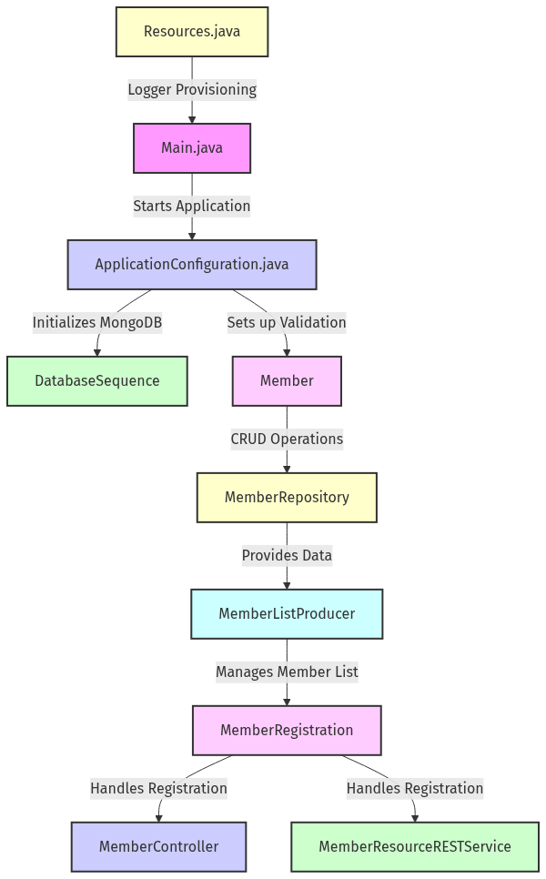
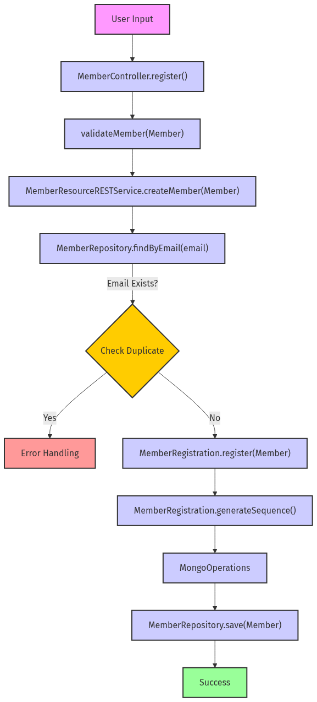
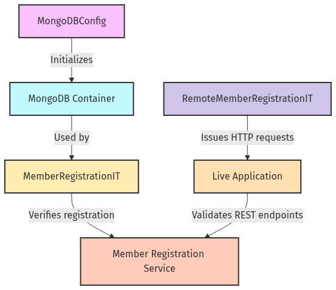

# kitchensink-main

A Spring Boot–based Java application from the JBoss Quickstarts demonstrating member management with MongoDB. It offers both MVC and REST interfaces, uses Spring Data for persistence, integrates validation, and includes containerized integration tests with Testcontainers.

## Table of Contents

- [Overview](#overview)
- [Architecture](#architecture)
  - [System Architecture](#system-architecture)
- [Configuration](#configuration)
  - [Application Configuration](#application-configuration)
  - [Testcontainers MongoDB Configuration](#testcontainers-mongodb-configuration)
- [Core Components](#core-components)
  - [Data Model](#data-model)
  - [Data Access Layer](#data-access-layer)
  - [Producer Components](#producer-components)
  - [Service Layer](#service-layer)
  - [Web Layer](#web-layer)
    - [MVC Controller](#mvc-controller)
    - [REST Controller](#rest-controller)
  - [Utility Components](#utility-components)
- [Workflows](#workflows)
  - [Member Registration Workflow](#member-registration-workflow)
- [Testing](#testing)
  - [Integration Tests](#integration-tests)

## Overview

This application is a kitchen-sink example showcasing how to build a Spring Boot service with MongoDB persistence. It demonstrates:

- A Spring Boot entry point with auto-configuration and servlet packaging via `Main.java`.
- Initialization of MongoDB collections and validation hooks at startup.
- A rich domain model (`Member` and `DatabaseSequence`) persisted through Spring Data MongoDB.
- A service layer (`MemberRegistration`) encapsulating business logic for member creation and unique ID generation.
- Data access via a repository interface (`MemberRepository`) and a list producer (`MemberListProducer`).
- Dual web interfaces: an MVC controller for server-side views (`MemberController`) and a REST API (`MemberResourceRESTService`).
- Prototype-scoped logger provisioning (`Resources`).
- Integration tests using Testcontainers to manage an ephemeral MongoDB container.

## Architecture

The application follows a layered architecture:

- **Initialization Layer**: Bootstraps Spring Boot, creates MongoDB collections, and registers validation listeners.
- **Domain Layer**: Defines data models representing MongoDB documents.
- **Data Access Layer**: Exposes repository abstractions and producers to retrieve and manipulate domain data.
- **Service Layer**: Encapsulates business logic for registering members and generating unique IDs.
- **Web Layer**: Presents two entry points:
  - MVC for server-rendered views.
  - RESTful HTTP endpoints.
- **Utility Layer**: Provides cross-cutting concerns such as logging.



This diagram illustrates the high-level architecture of a Spring Boot application, showcasing the main components involved in the application startup and their interactions. It highlights the entry point via 'Main.java' and configuration through 'ApplicationConfiguration.java'. The domain model is represented by 'Member' and 'DatabaseSequence', while the data access layer includes 'MemberRepository' and 'MemberListProducer'. The service layer is encapsulated in 'MemberRegistration', and two web interfaces are depicted: 'MemberController' for MVC and 'MemberResourceRESTService' for RESTful interactions. Additionally, 'Resources.java' is included for logger provisioning. The diagram effectively visualizes component scanning, MongoDB interactions, and validation listener registration within the application.

## Configuration

### Application Configuration

Located in `config/ApplicationConfiguration.java`, this class implements `ApplicationListener<ApplicationReadyEvent>` to ensure that two MongoDB collections—`DatabaseSequence` and `Member`—exist at startup, creating them if necessary. It also registers a `ValidatingMongoEventListener` to enforce bean validation on document save operations.

Key methods:
```java
public void onApplicationEvent(ApplicationReadyEvent event) { ... }
@Bean
public ValidatingMongoEventListener validatingMongoEventListener(LocalValidatorFactoryBean factory) { ... }
@Bean
public LocalValidatorFactoryBean validator() { ... }
```
Dependencies: `MongoOperations` for collection checks and creation, `LocalValidatorFactoryBean` for validation.

### Testcontainers MongoDB Configuration

In `test/config/MongoDBConfig.java`, a static `MongoDBContainer` is initialized using Testcontainers. The container starts when the class is loaded, exposing port 27017 and setting a system property for the mapped port. This enables integration tests to run against a real MongoDB instance without external dependencies.

Key snippet:
```java
public static MongoDBContainer mongoDBContainer;
static {
    mongoDBContainer = new MongoDBContainer("mongo:latest");
    mongoDBContainer.start();
    System.setProperty("MONGO_PORT", mongoDBContainer.getMappedPort(27017).toString());
}
```

## Core Components

### Data Model

- **Member** (`model/Member.java`):  
  - Annotated with `@Document` and implements `Serializable`.  
  - Fields: `id` (generated), `email`, `name`, `phoneNumber`.  
  - Validation: `@NotNull`, `@Size`, `@Email`, `@Indexed(unique=true)` for email.  
  - Accessors for each field.

- **DatabaseSequence** (`model/DatabaseSequence.java`):  
  - Annotated with `@Document`.  
  - Fields: `id` (sequence name), `sequence` (`BigInteger`).  
  - Simple getters/setters to manage the numeric counter.

### Data Access Layer

- **MemberRepository** (`data/MemberRepository.java`):  
  ```java
  public interface MemberRepository extends MongoRepository<Member, String> {
      Optional<Member> findById(String id);
      Optional<Member> findByEmail(String email);
      List<Member> findAllByOrderByNameAsc();
      void deleteMemberById(String id);
      void deleteMemberByEmail(String email);
  }
  ```  
  Leverages Spring Data MongoDB to auto-generate CRUD implementations based on method signatures.

### Producer Components

- **MemberListProducer** (`data/MemberListProducer.java`):  
  - Annotated `@Component`.  
  - Singleton bean that maintains an ordered `List<Member>`.  
  - On initialization (`@PostConstruct`), loads all members sorted by name.  
  - Observes member-change events to refresh the list.  
  - Exposes `getMembers()` for data binding in MVC views.

### Service Layer

- **MemberRegistration** (`service/MemberRegistration.java`):  
  - Annotated `@Service`.  
  - Dependencies: `Logger`, `MongoOperations`, `MemberRepository`.  
  - `register(Member member)`:  
    - Calls `generateSequence("members_sequence")` to assign a unique ID.  
    - Saves the `Member` via repository.  
    - Wraps `MongoWriteException` to propagate meaningful errors.  
  - `generateSequence(String seqName)`:  
    - Atomically increments `DatabaseSequence` in MongoDB.  
    - Returns `BigInteger.ONE` if no sequence exists.

### Web Layer

#### MVC Controller

- **MemberController** (`controller/MemberController.java`):  
  - Annotated `@Controller` and `@ViewScoped`.  
  - Constructor-injected `MemberRegistration` and `MemberListProducer`.  
  - `@PostConstruct refresh()`: Initializes `newMember` and reloads member list.  
  - `register()`: Validates and invokes `registration.register(newMember)`. On success, resets form; on failure, extracts root error message via `getRootErrorMessage(Throwable e)` and displays it via `FacesMessage`.  
  - Getters/Setters for `members` and `newMember` for JSF data binding.

#### REST Controller

- **MemberResourceRESTService** (`rest/MemberResourceRESTService.java`):  
  - Annotated `@RestController`.  
  - Constructor-injected `Logger`, `MemberRepository`, `MemberRegistration`.  
  - `listAllMembers()`: `GET /members` returns all members.  
  - `lookupMemberById(@PathVariable("id") long id)`: `GET /members/{id}` or throws `ResponseStatusException(NOT_FOUND)`.  
  - `deleteMemberById(@PathVariable("id") long id)`: `DELETE /members/{id}` or throws `ResponseStatusException(NOT_FOUND)`.  
  - `createMember(@RequestBody Member member)`: `POST /members`, calls `validateMember(member)`, then `registration.register(member)`.  
  - `validateMember(Member member)`: Ensures email uniqueness via `repository.findByEmail()`.  
  - `emailAlreadyExists(String email)`: Returns whether a duplicate exists.

### Utility Components

- **Resources** (`utils/Resources.java`):  
  - Annotated `@Configuration`.  
  - `@Bean` with `@Scope("prototype")` for `Logger produceLogger(InjectionPoint ip)`.  
  - Dynamically resolves the declaring class to provide a class-specific `java.util.logging.Logger`.

## Workflows

### Member Registration Workflow

This workflow covers both MVC and REST endpoints:

1. **User Input**:  
   - MVC: form backed by `MemberController.newMember`.  
   - REST: JSON payload to `/members`.

2. **Validation**:  
   - Controller or REST service calls `validateMember`, checking `repository.findByEmail(email)`.

3. **ID Generation**:  
   - `MemberRegistration.generateSequence` queries/increments `DatabaseSequence` via `MongoOperations`.

4. **Persistence**:  
   - `MemberRegistration.register` invokes `MemberRepository.save(member)`.

5. **Feedback & Refresh**:  
   - MVC: displays FacesMessage and invokes `refresh()`.  
   - REST: returns HTTP 201 with the created `Member`.



The diagram illustrates the member registration flow in a kitchen sink application, showcasing interactions between various components across MVC and REST layers. It highlights the sequence of operations starting from user input validation in the `MemberResourceRESTService.createMember` and `MemberController.register` methods, through uniqueness checks in `MemberRepository.findByEmail()`, to ID generation in `MemberRegistration.generateSequence()`. The flow culminates in data persistence via `MemberRepository.save()`, while also addressing error handling for duplicate entries. This diagram serves as a visual representation of the registration process, clarifying the relationships and responsibilities of each component involved.

## Testing

### Integration Tests

Two integration test suites validate end-to-end behavior:

- **MemberRegistrationIT** (`test/MemberRegistrationIT.java`):  
  - Uses `@SpringBootTest` and Testcontainers’ `MongoDBConfig`.  
  - Verifies that `MemberRegistration.register()` persists a member and assigns a non-null ID.

- **RemoteMemberRegistrationIT** (`test/RemoteMemberRegistrationIT.java`):  
  - Employs JUnit 5 and an HTTP client against the running Spring Boot server.  
  - `testRegister()`: Sends a POST to `/members`, asserts HTTP 201.  
  - `cleanUp()`: Deletes the created member to maintain a clean state.



The diagram illustrates the integration testing architecture for the kitchensink application, highlighting the interactions between key components. It showcases how the `MongoDBConfig` class initializes a Testcontainers MongoDB instance, providing a consistent testing environment. The `MemberRegistrationIT` class runs within a SpringBootTest context to validate the member registration service, ensuring that new members can be registered successfully. Additionally, the `RemoteMemberRegistrationIT` class issues HTTP requests against the live application, testing the REST endpoints for member registration and cleanup. This diagram effectively captures the relationships and workflows among these components, emphasizing their roles in the integration testing process.

