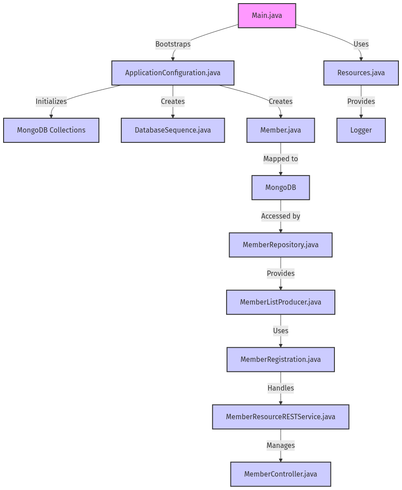
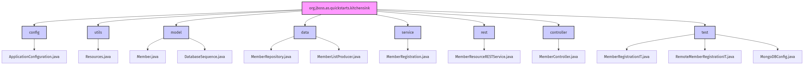

# Project Overview

Kitchen Sink Quickstart is a fully featured Spring Boot application that demonstrates a layered architecture for member management using MongoDB. It provides both a RESTful API and an MVC-based web interface, integrates robust configuration mechanisms, and includes comprehensive integration tests powered by Testcontainers.

## Table of Contents

- [Overview](#overview)
- [Getting Started](#getting-started)
  - [Prerequisites](#prerequisites)
  - [Build and Run](#build-and-run)
- [Architecture](#architecture)
  - [High-Level Architecture](#high-level-architecture)
  - [Package Structure](#package-structure)
- [Component Breakdown](#component-breakdown)
  - [Configuration Components](#configuration-components)
    - [Application Entry Point](#application-entry-point)
    - [MongoDB Initialization](#mongodb-initialization)
    - [Logging Resources](#logging-resources)
    - [Test Configuration](#test-configuration)
  - [Domain Model Components](#domain-model-components)
    - [Member Entity](#member-entity)
    - [Database Sequence](#database-sequence)
  - [Data Access Layer](#data-access-layer)
    - [MemberRepository](#memberrepository)
  - [Service Layer](#service-layer)
    - [MemberRegistration](#memberregistration)
  - [Web Layer Components](#web-layer-components)
    - [REST API](#rest-api)
    - [MVC Controller](#mvc-controller)
    - [Member List Producer](#member-list-producer)
- [API Usage](#api-usage)
  - [REST Endpoints](#rest-endpoints)
  - [MVC UI Flow](#mvc-ui-flow)
- [Testing](#testing)
  - [Integration Tests](#integration-tests)
    - [MemberRegistrationIT](#memberregistrationit)
  - [Remote Integration Tests](#remote-integration-tests)
    - [RemoteMemberRegistrationIT](#remotememberregistrationit)
- [Deployment](#deployment)
  - [Running with Testcontainers](#running-with-testcontainers)
  - [Production Deployment](#production-deployment)

## Overview

This sample application provides a complete demonstration of a Spring Boot–based member management system, showcasing:

- A robust startup sequence with MongoDB collection initialization.
- Domain objects with validation constraints.
- A repository layer for CRUD operations on MongoDB.
- A service layer that ensures unique, sequential identifiers.
- Both RESTful and MVC-based interfaces for client interactions.
- Integration tests leveraging Testcontainers to guarantee environment consistency.

By walking through the source, developers can learn how to structure production-grade Java applications with Spring and MongoDB.

## Getting Started

### Prerequisites

- Java 11 (or higher)
- Apache Maven 3.6+
- Docker (for Testcontainers–driven integration tests)
- A running MongoDB instance (or rely on Testcontainers during testing)

### Build and Run

1. Clone the repository and navigate to its root:

   ```bash
   git clone <repository>
   cd kitchensink-main
   ```

2. Build the application:

   ```bash
   mvn clean package
   ```

3. Run the application:

   ```bash
   java -jar target/kitchensink-main.jar
   ```

   Alternatively, use the Maven plugin:

   ```bash
   mvn spring-boot:run
   ```

## Architecture

The application follows a layered architecture that cleanly separates concerns:

- **Configuration**: Bootstraps the application and database.  
- **Domain Model**: Encapsulates validation and persistence annotations.  
- **Data Access**: Abstracts MongoDB operations via Spring Data.  
- **Service Layer**: Implements business logic and sequence generation.  
- **Web Layer**: Exposes REST endpoints and MVC controllers.  
- **Utilities**: Provides common beans such as loggers.  
- **Testing**: Ensures correctness with integration and remote tests.



The diagram illustrates the architecture of the Kitchensink application, highlighting the interactions between key components such as the Spring Boot entry point, configuration initialization, logging resources, domain model entities, data access layer, service layer, web layer, and MongoDB data store. It captures the flow of application startup, request handling for REST and MVC, and data persistence, providing a clear overview of how these elements collaborate to deliver functionality. The diagram serves as a visual guide for understanding the structure and behavior of the application, making it easier for developers to navigate and maintain the codebase.

### Package Structure

The codebase is organized under `org.jboss.as.quickstarts.kitchensink` with clear subpackages:

- `config` – application and MongoDB initialization  
- `utils` – common beans like Logger  
- `model` – domain entities  
- `data` – Spring Data repositories and producers  
- `service` – business logic for registration  
- `rest` – REST controllers  
- `controller` – MVC controllers  
- `test` – integration and remote integration tests  



The diagram illustrates the package hierarchy of the `org.jboss.as.quickstarts.kitchensink` project, showcasing its structure and relationships among various subpackages. It highlights key components such as configuration, utility, model, data access, service, REST, and controller layers, along with their respective classes. This visual representation aids in understanding the organization of the codebase, the flow of data, and the interactions between different modules, making it easier for developers to navigate and maintain the project.

## Component Breakdown

### Configuration Components

#### Application Entry Point

Managed by `Main.java`, this class extends `SpringBootServletInitializer`. It bootstraps the Spring context and MongoDB repositories:

```java
public static void main(String[] args) {
    try {
        SpringApplication.run(ApplicationConfiguration.class, args);
    } catch (Exception e) {
        LoggerFactory.getLogger(Main.class).error("Startup failed", e);
    }
}
```

It links the application startup to `ApplicationConfiguration` and ensures any initialization errors are logged.

#### MongoDB Initialization

`ApplicationConfiguration.java` listens for `ApplicationReadyEvent` to create missing collections:

- Injects `MongoOperations` for low-level DB tasks.
- Creates `DatabaseSequence` and `Member` collections if absent.
- Defines beans for `ValidatingMongoEventListener` and `LocalValidatorFactoryBean` to enforce validation on persisted entities.

#### Logging Resources

`Resources.java` defines a prototype-scoped `Logger` bean:

```java
@Bean
@Scope("prototype")
public Logger produceLogger(InjectionPoint ip) {
    return LoggerFactory.getLogger(ip.getMember().getDeclaringClass());
}
```

This ensures each class receives a context-aware logger without manual instantiation.

#### Test Configuration

`MongoDBConfig.java` (in test sources) uses Testcontainers to start a MongoDB instance:

- Declares `public static MongoDBContainer mongoDBContainer` that launches on class load.
- Ensures isolation and repeatability for integration tests.

### Domain Model Components

#### Member Entity

Defined in `Member.java`, this class maps to the `member` collection:

- Fields:  
  - `@Id String id`  
  - `@Indexed(unique=true) @Email String email`  
  - `@NotNull @Pattern String name`  
  - `@Size(min=10,max=15) @Pattern String phone`  
- Implements `Serializable`.
- Validation annotations guard against invalid data at persistence time.

#### Database Sequence

`DatabaseSequence.java` represents the `database_sequences` collection:

- Fields:  
  - `@Id String id`  
  - `BigInteger sequence`  
- Provides simple getters/setters to track and increment sequence values.

### Data Access Layer

#### MemberRepository

Located in `MemberRepository.java`, this interface extends `MongoRepository<Member,String>`:

- Out-of-the-box CRUD via inherited methods.
- Custom queries:  
  - `findById(BigInteger id)`  
  - `findByEmail(String email)`  
  - `findAllByOrderByNameAsc()`  
  - `deleteMemberById(BigInteger id)`  
  - `deleteMemberByEmail(String email)`

### Service Layer

#### MemberRegistration

`MemberRegistration.java` encapsulates business logic:

- Injects `MongoOperations` and `MemberRepository`.
- `register(Member m)`:  
  1. Calls `generateSequence("member_sequence")`  
  2. Persists new member, handling `MongoWriteException`.  
- `generateSequence(String seqName)`:  
  - Atomically increments the sequence in `database_sequences` and returns the new value.

### Web Layer Components

#### REST API

`MemberResourceRESTService.java` exposes HTTP endpoints:

- `@RestController` with base `/api/members`.
- Methods:  
  - `listAllMembers()` – `GET /api/members`  
  - `lookupMemberById(@PathVariable BigInteger id)` – `GET /api/members/{id}`  
  - `createMember(@RequestBody Member m)` – `POST /api/members`  
  - `deleteMemberById(@PathVariable BigInteger id)` – `DELETE /api/members/{id}`  
- Private validation ensures email uniqueness, throwing appropriate HTTP statuses on conflict or not found.

#### MVC Controller

`MemberController.java` is a `@Controller` with `@ViewScoped` state:

- Fields: `MemberRegistration`, `MemberListProducer`, `newMember`, `members`.
- `refresh()`: Resets `newMember` and reloads member list.
- `register()`: Validates and delegates to `memberRegistration.register(...)`, then refreshes or reports errors via `FacesContext`.
- Utility method `getRootErrorMessage(Exception)` extracts nested exception messages.

#### Member List Producer

`MemberListProducer.java` is a `@Component` that:

- Injects `MemberRepository`.
- Populates and caches a `List<Member>` on `@PostConstruct`.
- Observes custom events to refresh the list when members change.

## API Usage

### REST Endpoints

Interact with members programmatically:

- List all members:

  ```bash
  curl -X GET http://localhost:8080/api/members
  ```

- Get a member by ID:

  ```bash
  curl -X GET http://localhost:8080/api/members/{id}
  ```

- Create a new member:

  ```bash
  curl -X POST http://localhost:8080/api/members \
       -H "Content-Type: application/json" \
       -d '{"name":"Alice","email":"alice@example.com","phone":"1234567890"}'
  ```

- Delete a member:

  ```bash
  curl -X DELETE http://localhost:8080/api/members/{id}
  ```

### MVC UI Flow

The JSF-based UI binds to `MemberController`:

1. **View Load** triggers `refresh()` to display existing members.  
2. **Form Submit** invokes `register()`, which persists the new member and refreshes the list.  
3. **Error Handling** surfaces exceptions via `FacesContext` messages.

## Testing

### Integration Tests

#### MemberRegistrationIT

- Annotated with `@SpringBootTest` and wired to `MemberRegistration`.  
- Uses Testcontainers–driven MongoDB to verify `register()` assigns a non-null ID.  
- Fails the test if exceptions are thrown during persistence.

### Remote Integration Tests

#### RemoteMemberRegistrationIT

- Uses JUnit 5 to send real HTTP requests against `/api/members`.  
- `testRegister()` asserts a `201 Created` response and captures the created ID.  
- `cleanUp()` deletes the resource if created, ensuring environment cleanup.  
- Reads `SERVER_HOST` from environment or system properties.

### Test Configuration

`MongoDBConfig.java` ensures that a MongoDB container is available during tests, eliminating external dependencies and promoting reproducible builds.

## Deployment

### Running with Testcontainers

Integration tests automatically start a MongoDB container, ensuring tests can run on any CI/CD agent without external dependencies.

### Production Deployment

- Configure the MongoDB connection in `application.properties` or environment variables.  
- Ensure that the `member` and `database_sequences` collections exist (the application will auto-create them on startup).  
- Deploy the fat-jar to any Java application server or use the embedded Tomcat via:

  ```bash
  java -jar target/kitchensink-main.jar
  ```