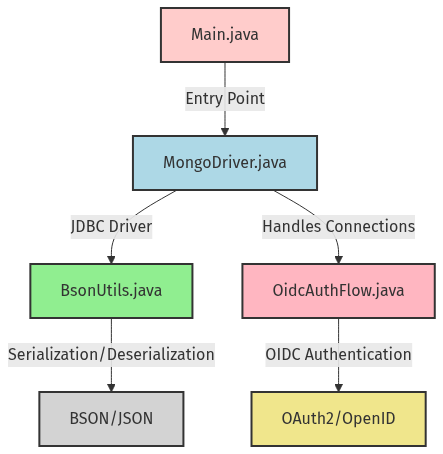
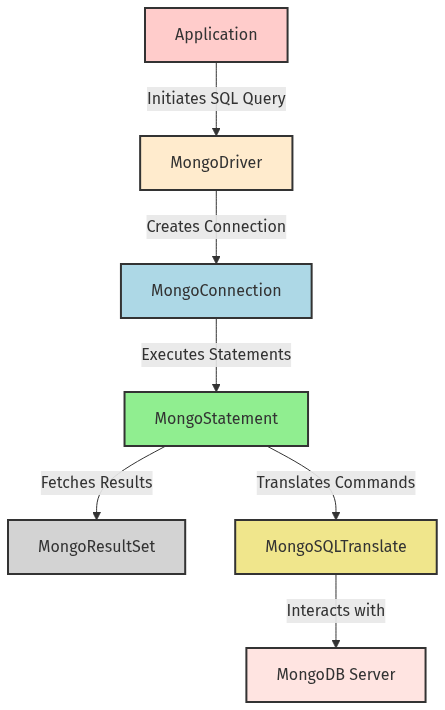

# MongoDB JDBC Driver

A production-grade JDBC driver for MongoDB that enables SQL-based interactions with MongoDB databases. It provides comprehensive support for connection management, SQL translation, schema mapping, authentication (including X.509 and OIDC), logging, and a full suite of unit, integration, and manual tests.

## Table of Contents

- [Overview](#overview)
- [Quick Start](#quick-start)
  - [Demo Application](#demo-application)
  - [Smoke Tests](#smoke-tests)
- [Architecture](#architecture)
  - [Module Structure](#module-structure)
  - [High-Level Data Flow](#high-level-data-flow)
- [Core Components](#core-components)
  - [MongoDriver and Connection](#mongodriver-and-connection)
  - [Statement and PreparedStatement](#statement-and-preparedstatement)
  - [ResultSet and Metadata](#resultset-and-metadata)
  - [SQL Translation Engine](#sql-translation-engine)
  - [Schema Mapping](#schema-mapping)
- [Authentication and Security](#authentication-and-security)
  - [X.509 Authentication](#x509-authentication)
  - [OIDC Authentication Flow](#oidc-authentication-flow)
- [Logging Infrastructure](#logging-infrastructure)
- [Utilities](#utilities)
  - [BSON and JSON Utilities](#bson-and-json-utilities)
  - [Native Library Loader](#native-library-loader)
- [Testing](#testing)
  - [Unit Tests](#unit-tests)
  - [Integration Tests](#integration-tests)
    - [Test Harness](#test-harness)
    - [Environment-Specific Tests](#environment-specific-tests)
- [Manual OIDC Tests](#manual-oidc-tests)

## Overview

The MongoDB JDBC Driver bridges SQL-based applications with MongoDB, translating SQL commands into MongoDB operations and mapping BSON schemas to relational metadata. Key features include:

- Full JDBC compliance: Driver, Connection, Statement, PreparedStatement, ResultSet, DatabaseMetaData, ResultSetMetaData.
- SQL translation engine for leveraging MongoDB’s aggregation framework.
- Transparent JSON schema mapping and BSON-to-SQL type conversions.
- Pluggable authentication: connection string credentials, X.509 certificates, and OpenID Connect (OIDC).
- Rich logging via annotations and custom formatters.
- Demonstration and smoke-test applications.
- Comprehensive unit, integration, and manual test suites.

## Quick Start

### Demo Application

A simple console app illustrating basic usage:

```java
public class Main {
  public static void main(String[] args) throws Exception {
    String url = "jdbc:mongodb://localhost:27017/testdb";
    try (Connection conn = DriverManager.getConnection(url)) {
      DatabaseMetaData md = conn.getMetaData();
      System.out.println("Driver name: " + md.getDriverName());
      // Further SQL queries...
    }
  }
  // displayResultSet(ResultSet rs) { … }
}
```

Located at `mongo-jdbc-driver-master\demo\src\main\java\com\mongodb\jdbc\demo\Main.java`, it demonstrates:

- JDBC `DriverManager` registration.
- Connection setup via URL and optional properties.
- Retrieving and printing metadata.

### Smoke Tests

The smoke-test suite (`SmokeTest.java`) validates basic connectivity and query execution against local and remote MongoDB instances. Key methods:

- `getADFInstanceConnection()`
- `getDirectRemoteInstanceConnection()`
- `databaseMetadataTest()`
- `queryTest()`

Run via your IDE or Maven test phase to ensure environment readiness.

## Architecture

### Module Structure

A high-level view of packaging and relationships across the repository:



The diagram provides a module-level overview of a Java application that connects to a MongoDB database using JDBC. It illustrates the relationships between key components, including the entry point in Main.java, the MongoDB driver in MongoDriver.java, utility functions in BsonUtils.java, and the OIDC authentication flow in OidcAuthFlow.java. Each component is represented with its primary responsibilities, showcasing how they interact to facilitate database connections, data serialization, and secure authentication. This visual representation aids in understanding the architecture and flow of the application, making it easier to identify dependencies and functionalities.

The codebase is organized into:

- `demo/`: A simple application.
- `smoketest/`: Environment verification.
- `src/main/java/com/mongodb/jdbc/`: Core driver implementation.
- `src/integration-test/java/com/mongodb/jdbc/integration/`: Integration testing harness and test cases.
- `src/test/java/com/mongodb/jdbc/`: Unit tests.
- `src/main/java/com/mongodb/jdbc/oidc/`: OIDC authentication flow.
- `src/main/java/com/mongodb/jdbc/logging/`: Logging annotations and utilities.
- `src/main/java/com/mongodb/jdbc/utils/`: Low-level utilities.

### High-Level Data Flow

Sequence of an SQL query from application to MongoDB and back:



The diagram illustrates the data flow within a MongoDB JDBC driver application, showcasing how various components interact to execute SQL queries. It begins with the application initiating a SQL query through the MongoDriver, which creates a MongoConnection. The MongoConnection then utilizes MongoStatement to execute the SQL commands, fetching results via MongoResultSet. Additionally, MongoSQLTranslate translates SQL commands into MongoDB operations, ensuring seamless communication with the MongoDB server. This flow highlights the relationships and responsibilities of each component in the context of SQL execution and data retrieval.

1. **`MongoDriver.connect()`** registers and creates a **`MongoConnection`**.
2. **`MongoConnection.createStatement()`** or **`prepareStatement()`** produces **`MongoStatement`** / **`MongoPreparedStatement`**.
3. Statement execution invokes **`MongoSQLTranslate`** to convert SQL ↔ Mongo commands.
4. **`MongoResultSet`** wraps a BSON cursor, exposing JDBC `ResultSet` API.
5. Metadata classes (`MongoDatabaseMetaData`, `MongoResultSetMetaData`) adapt BSON schemas to JDBC metadata.

## Core Components

### MongoDriver and Connection

- **MongoDriver.java**  
  - Implements `java.sql.Driver`.  
  - Singleton registration with `DriverManager`.  
  - Factory for `MongoConnection` objects.  
  - Normalizes properties, error handling, version checks.

- **MongoConnectionProperties.java**  
  - Immutable holder for connection settings (URI, database, logging flags).  
  - Generates cache key for property reuse.

- **MongoConnection.java**  
  - Implements `java.sql.Connection`.  
  - Manages `MongoClientSettings`, cluster type detection (Atlas/Enterprise/Community).  
  - Validates connectivity, maintains IDs for connection and statements.  
  - Logging via `MongoLogger`.

### Statement and PreparedStatement

- **MongoStatement.java**  
  - Implements `java.sql.Statement`.  
  - Executes SQL strings via delegated MongoDB operations.  
  - Handles fetch size, timeouts, and result set lifecycle.  
  - Unsupported JDBC methods throw `SQLFeatureNotSupportedException`.

- **MongoPreparedStatement.java**  
  - Implements `java.sql.PreparedStatement`, delegates to `MongoStatement`.  
  - Parameter binding stubbed; logs unsupported operations.  
  - Key methods: `executeQuery()`, `executeUpdate()`, `setString(int, String)`, etc.

### ResultSet and Metadata

- **MongoResultSet.java**  
  - Implements `java.sql.ResultSet`.  
  - Wraps a BSON cursor; maintains current row, row number, closed state.  
  - Converts BSON types → Java types (e.g., `getString()`, `getTimestamp()`).
  
- **MongoResultSetMetaData.java**  
  - Implements `ResultSetMetaData`.  
  - Maps column labels, types, nullability from BSON schema.

- **MongoDatabaseMetaData.java**  
  - Implements `DatabaseMetaData`.  
  - Exposes tables, columns, procedures, and privileges as SQL metadata views.

### SQL Translation Engine

- **MongoSQLTranslate.java**  
  - Annotated with `@AutoLoggable` for entry logging.  
  - Methods: `runCommand(BsonDocument)`, `getMongosqlTranslateVersion()`, `buildCatalogDocument(...)`.  
  - Bridges SQL to MongoDB commands, handles codec serialization.

### Schema Mapping

- **BsonTypeInfo.java**  
  - Enum mapping BSON types → JDBC types, precision, scale, byte length.

- **MongoJsonSchema.java** & **MongoVersionedJsonSchema.java**  
  - Convert JSON schema ↔ MongoDB schema, flatten `anyOf`, simplify nested structures.

- **JsonSchema.java**  
  - POJO for JSON schema deserialization, overrides `equals`/`hashCode`.

- **MongoColumnInfo.java**  
  - Immutable metadata for a single column: data source, field name, `BsonTypeInfo`, nullability.

## Authentication and Security

### X.509 Authentication

- **X509Authentication.java**  
  - Configures SSL/TLS using PEM certificates via Bouncy Castle.  
  - Methods: `configureX509Authentication(MongoClientSettings.Builder, String pemPath, char[] passphrase)`, `createSSLContext(PemReader...)`.

### OIDC Authentication Flow

- **OidcAuthFlow.java**  
  - Implements OAuth2/OpenID Connect code flow, token refresh.  
  - Builds authorization URL, opens browser, listens for callback.

- **JdbcOidcCallback.java** & **JdbcOidcCallbackContext.java**  
  - `OidcCallback` implementation for JDBC use.  
  - Processes refresh tokens vs. auth code flows.

- **JdbcIdpInfo.java**  
  - Implements `MongoCredential.IdpInfo`: issuer, clientId, scopes.

- **OidcResponse.java**, **OidcTimeoutException.java**  
  - Data structures and exceptions for callback server.

- **RFC8252HttpServer.java**  
  - Minimal HTTP server per RFC8252 for callback capture.

## Logging Infrastructure

- **AutoLoggable.java** / **DisableAutoLogging.java**  
  - Annotations to mark classes/methods for automatic entry logging via `LoggingAspect`.

- **MongoLogger.java**  
  - Contextual logger managing connection/statement IDs, method entry/error logs.

- **MongoSimpleFormatter.java**  
  - Custom `Formatter` for human-readable log entries: timestamp, level, source, exceptions.

- **QueryDiagnostics.java**  
  - DTO capturing executed SQL, pipeline, schema, metadata for diagnostic logging.

## Utilities

### BSON and JSON Utilities

- **BsonUtils.java**  
  - Serialize/deserialize `BsonDocument` ↔ byte[]; convert objects via `Codec<T>` to JSON strings.  
  - Settings: relaxed JSON writer, indentation control.

- **MongoBsonValue.java**  
  - Wrapper for MongoDB `BsonValue` to output extended JSON.

- **SortableBsonDocument.java**  
  - Extends `BsonDocument`, implements `Comparable` based on sort specifications.

- **Pair.java**  
  - Generic tuple class for two related values.

### Native Library Loader

- **NativeLoader.java**  
  - Loads JNI libraries bundled inside JARs.  
  - Handles OS/arch normalization, creates a temp directory, avoids duplicate loads.

## Testing

### Unit Tests

Organized under `src/test/java/com/mongodb/jdbc/`:

- **Connection**: `MongoConnectionTest.java`
- **Driver**: `MongoDriverTest.java`
- **Database Metadata**: `MongoDatabaseMetaDataTest.java`
- **ResultSet & Metadata**: `MongoResultSetTest.java`, `MongoResultSetMetaDataTest.java`
- **Statements**: `MongoStatementTest.java`
- **SQL Translation**: `MongoSQLTranslateLibTest.java`
- **Utils**: `BsonUtilsTest.java`, `TestConnectionString.java`
- **JSON Schema**: `MongoJsonSchemaTest.java`
- **OIDC Server**: `RFC8252HttpServerTest.java`
- **BSON Type Info**: `BsonTypeInfoTest.java`

Each test suite uses JUnit (and Mockito where needed) to assert correct behavior, exception handling, and edge cases.

### Integration Tests

#### Test Harness

Under `src/integration-test/java/com/mongodb/jdbc/integration/testharness/`:

- **DataLoader.java**: Loads YAML-based test data into MongoDB.
- **IntegrationTestUtils.java**: Runs metadata and SQL tests against connections.
- **TestGenerator.java**: Generates baseline YAML test files from live queries.
- **Models**: `TestTypeInfo`, `TestData`, `TestDataEntry`, `TestEntry`, `Tests` define test configurations and expected results.

#### Environment-Specific Tests

Under `src/integration-test/java/com/mongodb/jdbc/integration/`:

- **ADFIntegrationTest.java**: Tests against Azure Data Factory instances.
- **AuthX509IntegrationTest.java**: Validates X.509 auth scenarios.
- **DCIntegrationTest.java**: Tests data-center and remote cluster configurations.

## Manual OIDC Tests

Standalone utilities under `src/main/java/com/mongodb/jdbc/oidc/manualtests/`:

- **TestOidcAuthFlow.java**
- **TestOidcAuthFlowAndRefresh.java**
- **TestOidcCallback.java**
- **TestOidcCallbackWithBadRefreshToken.java**
- **TestOidcCallbackWithShortTimeout.java**
- **TestRFC8252Server.java**
- **TestOidcUtils.java**

These classes demonstrate and validate OIDC authentication flows, callback handling, and error scenarios with minimal dependencies—ideal for manual verification.