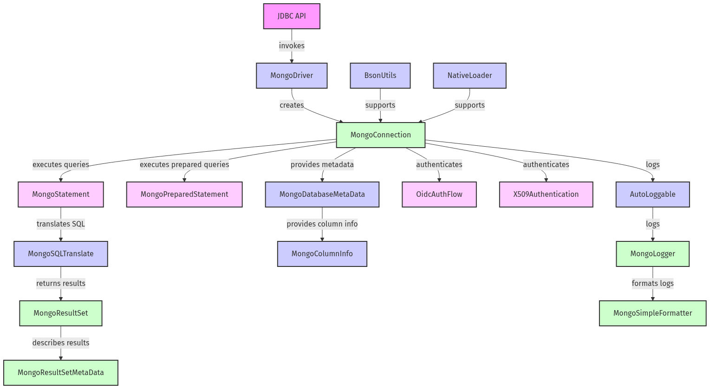
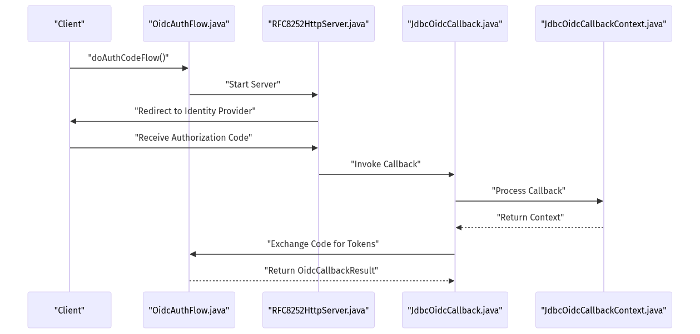
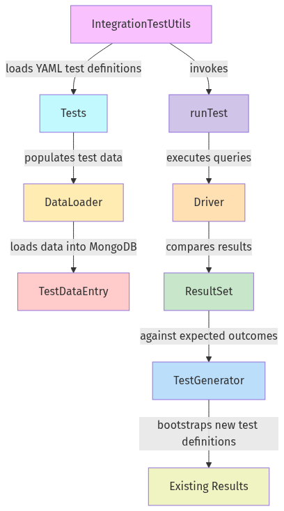

# mongo-jdbc-driver-master

A production-grade JDBC driver for MongoDB, enabling Java applications to interact with MongoDB clusters through standard SQL APIs. Features include SQL-to-Mongo translation, schema mapping, advanced authentication (OIDC, X.509), detailed logging, and a comprehensive testing framework.

## Table of Contents

- [Overview](#overview)
- [Architecture](#architecture)  
  - [High-Level Module Diagram](#high-level-module-diagram)
- [Core Components](#core-components)  
  - [Driver Entry Point: MongoDriver](#driver-entry-point-mongodriver)  
  - [Connection Management: MongoConnection and MongoConnectionProperties](#connection-management-mongoconnection-and-mongoconnectionproperties)  
  - [Statement API: MongoStatement and MongoPreparedStatement](#statement-api-mongostatement-and-mongopreparedstatement)  
  - [Result Set Handling: MongoResultSet and MongoResultSetMetaData](#result-set-handling-mongoresultset-and-mongoresultsetmetadata)  
  - [Database Metadata: MongoDatabaseMetaData and MongoColumnInfo](#database-metadata-mongodatabasemetadata-and-mongocolumninfo)  
  - [SQL Translation Engine: MongoSQLTranslate](#sql-translation-engine-mongosqltranslate)  
  - [Authentication](#authentication)  
    - [OIDC Flow](#oidc-flow)  
    - [X.509 Authentication](#x509-authentication)  
  - [Logging Infrastructure](#logging-infrastructure)  
  - [Utility Classes](#utility-classes)
- [Demo Module](#demo-module)
- [Testing](#testing)  
  - [Unit Tests](#unit-tests)  
  - [Integration Tests](#integration-tests)  
  - [Integration Test Harness](#integration-test-harness)

## Overview

The MongoDB JDBC Driver implements the `java.sql` interfaces to allow seamless SQL operations against MongoDB databases. It translates SQL queries into MongoDB commands, materializes results as JDBC `ResultSet` objects, and exposes database metadata. Built-in support for OpenID Connect and X.509 authentication ensures enterprise-grade security, while a flexible logging subsystem provides observability. A demo application and a comprehensive suite of unit and integration tests facilitate rapid development and validation.

## Architecture

At a high level, the driver consists of modules for driver registration, connection management, SQL translation, statement execution, result set processing, metadata exposure, authentication, logging, and utilities.



The diagram illustrates the high-level architecture of the MongoDB JDBC driver, showcasing the primary modules and their interactions. It highlights how the JDBC API interfaces with the MongoDriver to establish connections via MongoConnection. The flow of query execution is depicted through MongoStatement and MongoPreparedStatement, which utilize MongoSQLTranslate for SQL to MongoDB command translation. The diagram also includes components for result handling, such as MongoResultSet and MongoResultSetMetaData, alongside authentication modules like OidcAuthFlow and X509Authentication. Additionally, it features the logging subsystem and utility classes that support BSON handling and native library loading, providing a comprehensive overview of the system's architecture.

## Core Components

### Driver Entry Point: MongoDriver

The `MongoDriver` class implements `java.sql.Driver` and registers with `DriverManager`. It parses JDBC URLs, maps properties to a `MongoConnectionConfig`, handles authentication parameters, and maintains a cache of `MongoClient` instances for reuse.

Key methods:

```java
public Connection connect(String url, Properties props) throws SQLException
public boolean acceptsURL(String url) throws SQLException
```

The driver uses the `MongoJDBCProperty` enum to validate connection options and ensures thread-safe client caching via synchronized maps.

### Connection Management: MongoConnection and MongoConnectionProperties

`MongoConnection` implements `java.sql.Connection`, managing authentication handshakes (including OIDC and X.509), session settings (auto-commit, read-only), and lifecycle (open/close). It delegates query execution to statements and offers internal validation via test queries.

`MongoConnectionProperties` encapsulates all connection attributes:

- `connectionString`, `database`
- Logging level and directory
- Extended JSON mode
- X.509 PEM path
- Unique key generation for caching

Its getters ensure controlled access and immutability of configuration once constructed.

### Statement API: MongoStatement and MongoPreparedStatement

- **MongoStatement** implements `java.sql.Statement`, determining the cluster type (standalone, replica set, sharded) and selecting the execution strategy. It handles fetch sizes, query timeouts, and resource management.
- **MongoPreparedStatement** implements `java.sql.PreparedStatement`, wrapping a `MongoStatement` to support precompiled SQL. Unsupported JDBC methods throw `SQLFeatureNotSupportedException`. Method entries are logged via the `@AutoLoggable` annotation.

Example:

```java
public ResultSet executeQuery(String sql) throws SQLException
```

### Result Set Handling: MongoResultSet and MongoResultSetMetaData

- **MongoResultSet** implements `java.sql.ResultSet`, iterating a MongoDB cursor, converting BSON types to Java types (BigDecimal, byte[], Date/Time), and handling nullability and row boundaries.
- **MongoResultSetMetaData** implements `ResultSetMetaData`, exposing column count, labels, types, and case sensitivity. It reads schema information and select-order definitions to reflect accurate metadata.

### Database Metadata: MongoDatabaseMetaData and MongoColumnInfo

`MongoDatabaseMetaData` implements `java.sql.DatabaseMetaData`, exposing SQL keywords, procedures, table types, and schema details via BSON-backed result sets. It constructs metadata rows using helper methods and propagates SQL exceptions properly.

`MongoColumnInfo` is an immutable, thread-safe class mapping a MongoDB field to JDBC metadata, providing:

- Column label and name
- JDBC type and nullability
- BSON type via `BsonTypeInfo`

### SQL Translation Engine: MongoSQLTranslate

Annotated with `@AutoLoggable`, `MongoSQLTranslate` converts SQL commands to MongoDB CRUD and aggregation pipelines. It provides:

- `runCommand(String sql, Properties props)`: Invokes native or Java-based translation.
- `translateSQL(String sql)`: Returns a `TranslateResult` containing target database, collection, pipeline, schema, and select order.
- Version checks and library loading via JNI.

### Authentication

#### OIDC Flow

The `OidcAuthFlow` class orchestrates OpenID Connect authorization code and token-refresh flows. It generates scopes, builds authorization URLs, and exchanges codes for tokens. A lightweight HTTP server (`RFC8252HttpServer`) listens for callbacks and populates `OidcCallbackContext` and `OidcResponse`. `JdbcOidcCallback` integrates with JDBC connections to supply OIDC credentials seamlessly.



The OidcAuthFlowDiagram illustrates the sequence of operations involved in the OpenID Connect (OIDC) authentication flow. It begins with the client invoking the `doAuthCodeFlow` method from the `OidcAuthFlow` class, which initiates the `RFC8252HttpServer`. The user is then redirected to the Identity Provider for authentication. Upon successful authentication, an authorization code is received via a JDBC callback, which is subsequently exchanged for access and refresh tokens. Finally, the flow concludes with the return of an `OidcCallbackResult`. This diagram effectively captures the interactions between the key components involved in the OIDC process, providing a clear visual representation of the workflow.

#### X.509 Authentication

`X509Authentication` configures SSL contexts from PEM files, extracting private keys and certificates via Bouncy Castle, and integrates with `MongoClientSettings` for certificate-based authentication. It verifies file integrity and initializes `KeyManager` arrays for secure connections.

### Logging Infrastructure

The driver uses aspect-oriented logging:

- `@AutoLoggable` marks methods for entry/exit logging.
- `DisableAutoLogging` suppresses logging for specific classes or methods.
- `MongoLogger` wraps `java.util.logging.Logger` to emit structured logs, including connection and statement identifiers.
- `MongoSimpleFormatter` formats log records with timestamps, levels, source, and stack traces.
- `QueryDiagnostics` holds per-query BSON diagnostics and pipeline information.

### Utility Classes

Stateless helpers streamline common tasks:

- `BsonUtils`: Serialize/deserialize `BsonDocument` to byte arrays and back.
- `NativeLoader`: Extract and load JNI libraries for translation engines.
- `Pair<L,R>`: Generic two-value container with proper `equals`/`hashCode`.
- `SortableBsonDocument`: Extends `BsonDocument` to implement `Comparable` for ordered results.
- `BsonExplicitCursor`: Implements `MongoCursor` over in-memory `BsonDocument` lists for testing.
- `TestTypeInfo`: Reflection-based SQL type name/int conversions for test assertions.

## Demo Module

The `demo` module showcases basic usage:

- **Main.java**:  
  Demonstrates establishing a JDBC connection and executing a query:
  ```java
  Connection conn = DriverManager.getConnection(url, props);
  ResultSet rs = conn.createStatement().executeQuery("SELECT * FROM test.collection");
  displayResultSet(rs);
  ```
- **PrintUtils.java**: Formats `ResultSetMetaData` and rows into console tables.
- **TestUtils.java**: Abstract base for tests, managing setup/teardown and metadata retrieval.
- **MongoSQLTestUtils.java**: Overrides connection logic for test environments, validating connectivity via a simple query.

## Testing

### Unit Tests

A suite of JUnit tests ensures correctness of individual components:

- **Type and Serialization**: `BsonTypeInfoTest`, `BsonUtilsTest`  
- **Connection and Configuration**: `MongoConnectionTest`, `TestConnectionString`  
- **Metadata**: `MongoDatabaseMetaDataTest`, `MongoResultSetMetaDataTest`  
- **Driver Registration**: `MongoDriverTest`, `MongoSQLTranslateLibTest`  
- **Result Sets and Statements**: `MongoResultSetTest`, `MongoStatementTest`  
- **JSON Schema**: `MongoJsonSchemaTest`  
- **OIDC HTTP Server**: `RFC8252HttpServerTest`  

Mocks (`MongoMock`) and Mockito facilitate isolated testing of behavior and edge cases.

### Integration Tests

Validates end-to-end scenarios:

- **SmokeTest**: Quick verification of connection, metadata, and simple queries.  
- **ADFIntegrationTest**, **DCIntegrationTest**: Extensive tests for UUID handling, concurrency, and cluster configurations.  
- **AuthX509IntegrationTest**: Verifies X.509 authentication success and failure cases under real certificates.

### Integration Test Harness

Automates data loading, test execution, and result validation using YAML-based definitions:

- **DataLoader.java**: Reads YAML models (`TestDataEntry`) and populates MongoDB collections, generating schemas and indexes.  
- **IntegrationTestUtils.java**: Recursively loads test configs (`Tests`), executes SQL queries or metadata commands, and validates results via `validateResultsOrdered` and `validateResultSetMetadata`.  
- **TestGenerator.java**: Generates baseline YAML files by capturing actual query results and metadata, populating `TestEntry` objects.  
- **TestTypeInfo.java**: Converts SQL type names to integer constants for assertion comparisons.



This diagram illustrates the workflow of the Integration Test Harness for the MongoDB JDBC framework. It showcases how `IntegrationTestUtils` loads YAML test definitions, while `DataLoader` populates MongoDB with test data. The tests invoke `runTest`, executing queries via the driver and comparing `ResultSet` or metadata against expected outcomes. Additionally, `TestGenerator` is responsible for bootstrapping new test definitions from existing results. The diagram effectively captures the interactions and dependencies among these components, providing a clear overview of the integration testing process.

